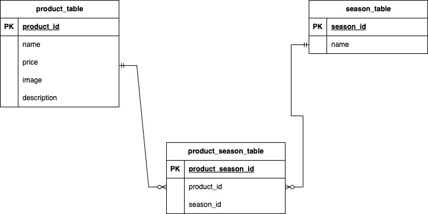

## 1.アプリケーションの概要

#### 1. アプリケーション名

　 mogitate

#### アプリケーションでできること

- 商品データ一覧（写真付き）の閲覧
- 商品の検索
- 商品データの更新・削除
- 商品データ一覧の並び替え（昇順・降順）


## 2.主要技術

| 言語・フレームワーク　 | バージョン |
| -------------------- | ---------- |
| nginx                | 1.21.1     |
| MySQL                | 8.0.26     |
| phpmyadmin           | latest     |
| Laravel              | 8.83.29    |
| Docker               | 28.0.4,    |


## 3.開発環境構築方法

#### 1. Docker と Docker Compose のインストール

Docker と Docker Compose をインストールしてください。インストール方法は公式ドキュメントを参照してください。


#### 2. リポジトリの設定

開発環境をGithubからクローン<br />
(例)coachtech/laravelディレクトリ以下にクローン　→　リポジトリ名を「20250618mogitate_endou」に変更
```
 cd coachtech/laravel
```

```
 git clone git@github.com:Endou9527/confirmation-test0616.git
```

```
 mv confirmation-test0616 20250618mogitate_endou
```

```
 cd 20250618mogitate_endou
```


#### ３. Dockerの設定

※カレントディレクトリは20250618mogitate_endouで
```
 docker-compose up -d --build
```
```
 code .
```
Dockerコンテナが作成されているかどうか確認してください


#### 2. Laravelパッケージのインストール

PHPコンテナへログイン

```
docker-compose exec php bash
```

パッケージのインストール

```
composer install
```


#### ４. .envファイルの作成

.env.exampleをコピー　→　「.env」へファイル名変更
```
cp .env.example .env
```


```
// 前略

DB_CONNECTION=mysql
- DB_HOST=127.0.0.1
+ DB_HOST=mysql
DB_PORT=3306
- DB_DATABASE=laravel
- DB_USERNAME=root
- DB_PASSWORD=
+ DB_DATABASE=laravel_db
+ DB_USERNAME=laravel_user
+ DB_PASSWORD=laravel_pass

// 後略

```


アプリケーションキーを生成

```
php artisan key:generate
```


## ５.その他特記事項

### ルーティング（※変更があります。）

  | ページ　   　　　　| ルーティング        　 |
  | ------------- | ----------------------------|
  | 商品一覧        | /products                   |
  | 商品詳細       | products/{productId}        |
  | 商品更新　　    | products/{productId}/update |
  | 商品登録       | __/register__　　　　　           |
  | 検索　　        | /products/search             |
  | 削除  　　      | /products/{productId}/delete |
  <br /> 
  <br />
  <br />

### ER図
　　
  <br /> 
  <br />
  <br />  

### 画像情報


### その他補足事項
  ####　ダミーデータ３件「りんご」「さくらんぼ」「マンゴー」を試験登録しました。

### URL
https://github.com/Endou9527/confirmation-test0616

